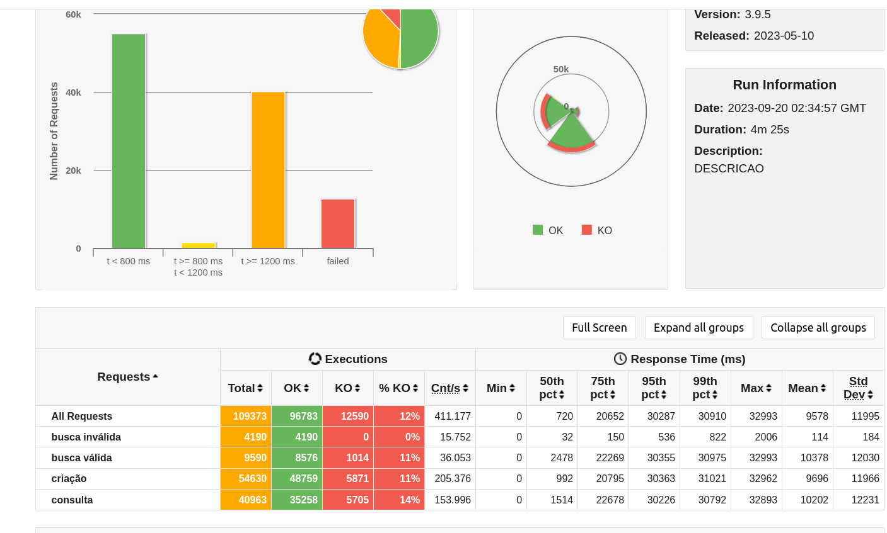

## Rinha de Backend / Backend dogfight

This is a submission for a Brazilian backend challenge. 
It involves the development of an API responsible for creating people, capable of handling requests
with the following specifications:

    Limited resources (1.5 cpu units, 3 GB RAM, allocated as you choose)
    A preferred programming language
    A choice of database (MongoDB, MySQL, or PostgreSQL)
    A load balancer and two API nodes

For more details, please visit: https://github.com/zanfranceschi/rinha-de-backend-2023-q3

### How to execute:
    docker compose up

### Stack

- Java 17 + Reactive Quarkus ( 2x 0.5 / 700M ) 
- Postgres ( 0.35 / 1150M )
- Nginx ( 0.1 / 400M )
- Redis ( 0.05 / 50M )

### Results
- 48759 Inserts
- 99pth pct: 31021ms
- execution time: 265s
- Total OK requests: 96783

